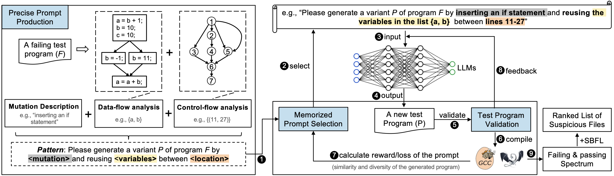

# LLM4CBI

Implementation of the tool ***LLM4CBI*** in the TSE paper  **"Isolating Compiler Bugs by Generating Effective Witness Programs with Large Language Models"** ([arXiv](https://arxiv.org/pdf/2307.00593.pdf))


## Overview of LLM4CBI




## Setup Instructions

### Experimental environment

* Operating System: Ubuntu 18.04
* Python version: 3.9.16
* Torch version 1.4.0

### Step 1: Build compilers with coverage profilers (i.e.,`gcov`)

```
# To isolate GCC bugs for example
$ cd llm4cbi-gcc
$ python setup-gcc.py
```

We provide the required compiler version in the file `llvmbug.txt` and `gccbugs.txt`. An example of this format shown in gccbugs.txt is as follows:

 ```
57303,r198967,-O0,-O1,checkIsPass_wrongcodeOneline,install_no
```

* `57303` is the bug ID in the [GCC bug repository](https://gcc.gnu.org/bugzilla/).
* `r198967` is the buggy version on SVN.
* `-O0,-O1` are correct and wrong optimization options.
* `checkIsPass_wrongcodeOneline` is the test oracle checking, please refer to the description [here]( https://github.com/haoyang9804/RecBi/tree/master?tab=readme-ov-file#deploying--1--preparing-for-installing-target-llvm-trunk).
* `install_no` means this LLVM trunk has not been installed while `install_yes` means the opposite.

### Step 2: Run `LLVM4CBI` and get the ranking results
```
# To isolate GCC bugs for example
$ cd llm4cbi-gcc
$ python gcc-run.py gpt-1
```

### The output of a running example (GCC bug 57303)

```
Begin batchrun
bugIds:  57303
revisions:  r198967
rights:  -O0
wrongs:  -O1
checkpasses:  checkIsPass_wrongcodeOneline
configFile:  /home/haoxin/disk-dut/research/xxx/config-gpt-1/config.ini
Begin delete
Begin rank
Begin analyze
finallist =  [[1]] 
result =  {'Top-1': 1, 'Top-5': 1, 'Top-10': 1, 'Top-20': 1, 'MFR': 1.0, 'MAR': 1.0} 
```

In the above example, `LLM4CBI` ranks the suspicious file at Top-1. 


## Reference
```
@article{tu2024isolating,
  title={{Isolating Compiler Bugs by Generating Effective Witness Programs with Large Language Models}},
  author={Tu, Haoxin and Zhou, Zhide and Jiang, He and Yusuf, Imam Nur Bani and Li, Yuxian and Jiang, Lingxiao},
  journal={IEEE Transactions on Software Engineering},
  year={2024},
  pages = {1--20},
  publisher={IEEE}
}
```
