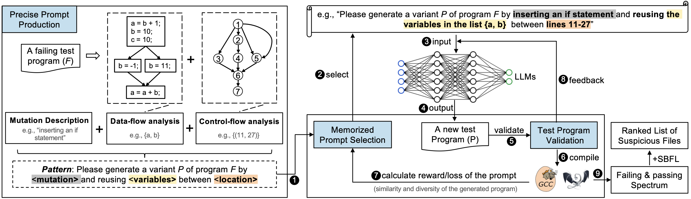

# LLM4CBI

Implementation of the tool ***LLM4CBI*** in the paper  **"LLM4CBI: Taming LLMs to Generate Effective Test Programs for Compiler Bug Isolation"** ([arXiv](https://arxiv.org/pdf/2307.00593.pdf))

Note: We plan to release the source code after accepting this paper. (currently under review on IEEE TSE)


## Overview of LLM4CBI




## Reference
```
@misc{tu2023llm4cbi,
      title={LLM4CBI: Taming LLMs to Generate Effective Test Programs for Compiler Bug Isolation}, 
      author={Haoxin Tu and Zhide Zhou and He Jiang and Imam Nur Bani Yusuf and Yuxian Li and Lingxiao Jiang},
      year={2023},
      eprint={2307.00593},
      archivePrefix={arXiv},
      primaryClass={cs.SE}
}
```
